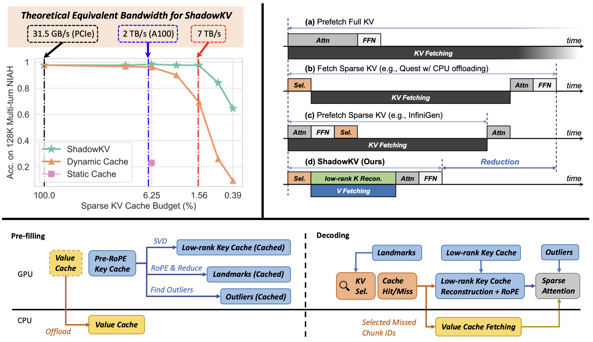

<div align="center">
<h1> ShadowKV: KV Cache in Shadows for High-Throughput Long-Context LLM Inference</h1>

**training-free, high-throughput long-context LLM inference**
</div>
<div align="center">
<b><a href="https://github.com/preminstrel">Hanshi Sun</a></b><sup>1,2</sup>,
<b><a href="https://lchang20.github.io/">Li-Wen Chang</a></b><sup>2</sup>,
<b><a href="https://sites.google.com/view/wenleibao/">Wenlei Bao</a></b><sup>2</sup>,
<b><a href="https://sizezheng.github.io/">Size Zheng</a></b><sup>2</sup>,
<b><a href="https://zheng-ningxin.github.io/">Ningxin Zheng</a></b><sup>2</sup>,
<b><a href="https://scholar.google.com/citations?user=ZMfk2F8AAAAJ&hl=zh-CN">Xin Liu</a></b><sup>2</sup>,
<br>
<b><a href="https://www.andrew.cmu.edu/user/harryd/">Harry Dong</a></b><sup>1</sup>,
<b><a href="https://users.ece.cmu.edu/~yuejiec/">Yuejie Chi</a></b><sup>1</sup>,
<b><a href="https://www.andrew.cmu.edu/user/beidic/">Beidi Chen</a></b><sup>1</sup>
</div>
<div align="center">
<sup>1</sup>Carnegie Mellon University
<sup>2</sup>ByteDance Seed
</div>
<div align="center">
[<a href="https://arxiv.org/abs/2410.21465">Paper</a>] | [<a href="https://ByteDance-Seed.github.io/ShadowKV">Blog</a>]
</div>
<br>

<div align="center">

<figcaption>ShadowKV Framework</figcaption>
</div>

## 🔥 News
- **[2025.05]** ShadowKV has been accepted by **ICML 2025** as **Spotlight**!
- **[2024.10]** We have released the code.

## Environment Set Up
To reproduce the results in the paper, you need to set up the environment as follows with a single A100 GPU:
```bash
# create env
conda create -n ShadowKV python=3.10 -y
conda activate ShadowKV

# install packages
pip install -r requirements.txt
pip install flash-attn --no-build-isolation

# nemo dependencies (for dataset building)
pip install wheel
pip install Cython
pip install youtokentome
pip install nemo_toolkit[all]==1.23

# flashinfer
pip install flashinfer -i https://flashinfer.ai/whl/cu121/torch2.3/

# cutlass
mkdir 3rdparty
git clone https://github.com/NVIDIA/cutlass.git 3rdparty/cutlass

# build kernels for ShadowKV
python setup.py build_ext --inplace
```
## Supported Models
Currently, we support the following LLMs:
- Llama-3-8B-1M: [gradientai/Llama-3-8B-Instruct-Gradient-1048k](https://huggingface.co/gradientai/Llama-3-8B-Instruct-Gradient-1048k)
- GLM-4-9B-1M: [THUDM/glm-4-9b-chat-1m](https://huggingface.co/THUDM/glm-4-9b-chat-1m)
- Llama-3.1-8B: [meta-llama/Meta-Llama-3.1-8B-Instruct](https://huggingface.co/meta-llama/Meta-Llama-3.1-8B-Instruct)
- Yi-9B-200K: [01-ai/Yi-9B-200K](https://huggingface.co/01-ai/Yi-9B-200K)
- Phi-3-Mini-128K: [microsoft/Phi-3-mini-128k-instruct](https://huggingface.co/microsoft/Phi-3-mini-128k-instruct) (only NIAH test supported)
- Qwen2-7B-128K: [Qwen/Qwen2-7B-Instruct](https://huggingface.co/Qwen/Qwen2-7B-Instruct) (only NIAH test supported)

## Accuracy Evaluations
Here we provide an example to build the dataset and run evaluation for the [RULER](https://github.com/hsiehjackson/RULER) benchmark with Llama-3-8B-1M.

### Build Datasets
To build RULER dataset, please run the following command:
```bash
# build RULER
python -c "import nltk; nltk.download('punkt')"
cd data/ruler
bash create_dataset.sh "gradientai/Llama-3-8B-Instruct-Gradient-1048k" "llama-3"
```

### Run Evaluations
For the accuracy evaluation, please run the following command with 8xA100 GPUs:

```bash
# Full attention
OMP_NUM_THREADS=48 torchrun --standalone --nnodes=1 --nproc_per_node 8 test/eval_acc.py --datalen 131072 --method full --dataset_name "ruler/niah_single_1,ruler/niah_single_2,ruler/niah_single_3,ruler/niah_multikey_1,ruler/niah_multikey_2,ruler/niah_multiquery,ruler/niah_multivalue,ruler/vt,ruler/fwe,ruler/qa_1,ruler/qa_2" --model_name "gradientai/Llama-3-8B-Instruct-Gradient-1048k"

# ShadowKV
OMP_NUM_THREADS=48 torchrun --standalone --nnodes=1 --nproc_per_node 8 test/eval_acc.py --datalen 131072 --method shadowkv --dataset_name "ruler/niah_single_1,ruler/niah_single_2,ruler/niah_single_3,ruler/niah_multikey_1,ruler/niah_multikey_2,ruler/niah_multiquery,ruler/niah_multivalue,ruler/vt,ruler/fwe,ruler/qa_1,ruler/qa_2" --sparse_budget 2048 --rank 160 --chunk_size 8
```

#### Compatibility with MInference
ShadowKV is compatible with pre-filling acceleration techniques, such as MInference. To enable MInference, please add the `--minference` flag to the command. For example:

```bash
# Full attention with MInference
OMP_NUM_THREADS=48 torchrun --standalone --nnodes=1 --nproc_per_node 8 test/eval_acc.py --datalen 131072 --method full --dataset_name "ruler/niah_single_1,ruler/niah_single_2,ruler/niah_single_3,ruler/niah_multikey_1,ruler/niah_multikey_2,ruler/niah_multiquery,ruler/niah_multivalue,ruler/vt,ruler/fwe,ruler/qa_1,ruler/qa_2" --minference

# ShadowKV with MInference
OMP_NUM_THREADS=48 torchrun --standalone --nnodes=1 --nproc_per_node 8 test/eval_acc.py --datalen 131072 --method shadowkv --dataset_name "ruler/niah_single_1,ruler/niah_single_2,ruler/niah_single_3,ruler/niah_multikey_1,ruler/niah_multikey_2,ruler/niah_multiquery,ruler/niah_multivalue,ruler/vt,ruler/fwe,ruler/qa_1,ruler/qa_2" --sparse_budget 2048 --rank 160 --chunk_size 8 --minference
```

## Efficiency Evaluations
For the efficiency evaluation, please run the following command with a single A100 GPU:

```bash
python test/e2e.py --model_name "meta-llama/Meta-Llama-3.1-8B-Instruct" --datalen "122k"
```
## Citation
If you find ShadowKV useful or relevant to your project and research, please kindly cite our paper:

```bibtex
@article{sun2024shadowkv,
  title={ShadowKV: KV Cache in Shadows for High-Throughput Long-Context LLM Inference},
  author={Sun, Hanshi and Chang, Li-Wen and Bao, Wenlei and Zheng, Size and Zheng, Ningxin and Liu, Xin and Dong, Harry and Chi, Yuejie and Chen, Beidi},
  journal={arXiv preprint arXiv:2410.21465},
  year={2024}
}
```
